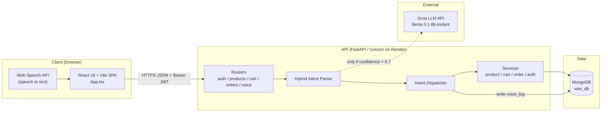
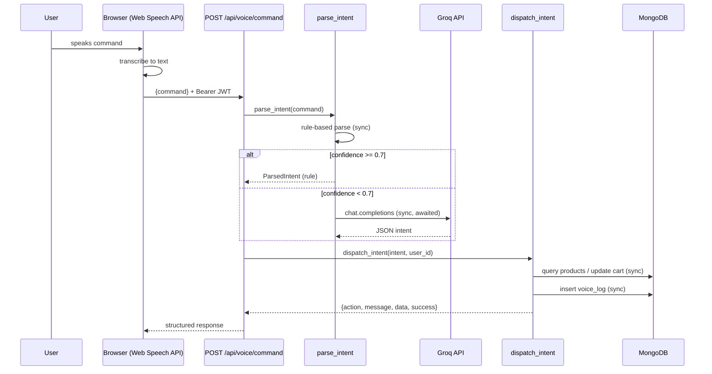

# VANI — Architecture Walkthrough & Critique

> Voice Assisted Navigation for Intelligent Commerce. Whole-system review generated from a read of the repo (backend FastAPI + frontend React/Vite + MongoDB). Evidence cited by file path. Unmeasured claims are marked "not measured".

---

## 1. TL;DR

- **Problem:** Let a shopper drive an e-commerce store hands-free by speaking natural language ("show me blue shoes under 50", "add it to cart", "checkout").
- **Core idea:** A **hybrid intent parser** — fast rule-based regex first, and only when its confidence < 0.7 does it fall back to a Groq LLM. This buys low latency + low cost on common commands and graceful degradation with no API key. (`backend/services/intent_parser.py:315`)
- **Stack in one breath:** React 18 + Vite frontend using the browser Web Speech API for speech-to-text → FastAPI backend → hybrid parser (regex + Groq `llama-3.1-8b-instant`) → Motor/MongoDB, JWT auth, deployed on Render.

---

## 2. The problem

| Dimension | Detail |
|---|---|
| Who | Shoppers who want a hands-free / accessibility-friendly storefront |
| Pain | Typing search + navigating menus is slow; voice is natural but "understanding" free-form speech is hard |
| Constraints | Low latency per command; LLM calls cost money and add latency; must still work if the LLM is unavailable; per-user analytics on command success |
| Why naive fails | **Pure LLM for every command** = expensive + slow + a hard dependency on an external API. **Pure regex** = brittle, can't handle phrasings the author didn't anticipate. Neither alone is good enough. |

---

## 3. The solution

The central decision is the **two-tier parser** (`intent_parser.py`):

1. `_rule_based_parse()` runs regex/keyword matching for the 8 supported intents and assigns a confidence score.
2. If confidence ≥ `CONFIDENCE_THRESHOLD` (0.7) → return immediately (no network call).
3. Else → `_groq_parse()` calls Groq with a JSON-mode system prompt and parses the result.
4. If no `GROQ_API_KEY` is set, it degrades to the rule parse rather than failing (`intent_parser.py:256`).

How each constraint is met:

| Constraint | Addressed by |
|---|---|
| Latency | Common commands never leave the process (rule tier) |
| Cost | LLM only invoked on low-confidence input |
| Resilience | Missing/failing Groq → rule-based fallback (`intent_parser.py:302`) |
| Analytics | Every command written to `voice_logs` with intent, confidence, parser used, success (`intent_dispatcher.py:204`) |

---

## 4. Architecture diagram

---

## 5. Components

| Component | Responsibility | Tech | Evidence |
|---|---|---|---|
| SPA | UI, cart/checkout state, mic capture | React 18, Vite, MUI + Radix + Tailwind, zustand, react-router 7 | `frontend/src/app/App.tsx`, `frontend/package.json` |
| Speech-to-text | Transcribe voice in-browser | Web Speech API | `App.tsx:2488` |
| API client | Typed fetch wrapper, JWT injection | TypeScript | `frontend/src/api/client.ts` |
| FastAPI app | HTTP, CORS, router mounting, lifespan | FastAPI + Uvicorn | `backend/main.py` |
| Intent parser | Rule tier + Groq fallback | regex, `groq` SDK | `backend/services/intent_parser.py` |
| Dispatcher | Map intent → service, log command | — | `backend/services/intent_dispatcher.py` |
| Services | Product search, cart, orders, auth | Motor | `backend/services/*.py` |
| Auth | Register/login, JWT verify | python-jose (HS256), bcrypt | `backend/utils/jwt_handler.py`, `backend/services/auth_service.py` |
| Database | Persistence + indexes | MongoDB via Motor | `backend/database/connection.py` |

**Collections:** `users`, `products`, `carts`, `orders`, `voice_logs`.

---

## 6. Critical flows

### Flow A — Voice command (the spine)

- Auth is enforced on `/voice/command` via `Depends(get_current_user)` (`voice_routes.py:31`).
- **State writes:** cart/order mutations + one `voice_logs` insert per command.
- **Pagination is client-side:** dispatcher fetches up to `limit=50` and `next_page`/`previous_page` intents just return a direction; the SPA pages through the already-fetched 50 (`intent_dispatcher.py:147`).

### Flow B — Order placement

1. `POST /api/orders` → `create_order` reads the cart.
2. Fetches product docs for each item, builds a **denormalized snapshot** (name/price/image at purchase time).
3. Inserts the order, then **separately** clears the cart. (`order_service.py:61-67`)
4. ⚠️ These two writes are **not in a transaction** — see §11 and §14.

### Flow C — Auth

Register/login → bcrypt verify → `create_access_token` (HS256, 24h) → SPA stores token + user in `localStorage` (`client.ts:16`).

---

## 7. Data model & storage

| Entity | Store | Shape | Access pattern | Index |
|---|---|---|---|---|
| users | `users` | name, email, password_hash | find by email (login) | `email` unique |
| products | `products` | flat doc + embedded `all_images`, `rating_distribution`, `customer_reviews` | filter by category/brand/price/rating; `$text` search w/ regex fallback | `id` unique, `category`, `price`, `brand`, text index on name/brand/category/about |
| carts | `carts` | one doc per user, embedded `items[]` | find/update by user_id | `user_id` unique |
| orders | `orders` | denormalized item snapshot + shipping | find by user_id, by _id | `user_id` |
| voice_logs | `voice_logs` | command, intent, params, success, confidence, parser | append-only + per-user aggregations | `user_id`, `created_at` |

Indexes are created at startup in `connect_to_mongodb()` (`database/connection.py:22`). This is a **good document-model fit**: embedded reviews, per-user cart doc, immutable order snapshots, append-only logs — none of it needs joins.

---

## 8. Tech stack & rationale

| Tech | Role | Why | Alternative | When alternative wins |
|---|---|---|---|---|
| FastAPI | HTTP API | async, Pydantic validation, auto OpenAPI `/docs` | Node/Express, Flask, Django | Node wins if you want one language across FE/BE (see note) |
| MongoDB / Motor | Persistence | flexible schema mirrors `products.json`; embedded docs; async driver | Postgres | Postgres wins once you need multi-row transactions, inventory, revenue reporting |
| Groq LLM | Fallback NLU | very fast, cheap inference; JSON mode | OpenAI/local model | OpenAI for quality; local model for zero external dependency |
| Rule parser | Primary NLU | zero-latency, zero-cost, deterministic | LLM-only | LLM-only when phrasings are too varied to enumerate |
| Web Speech API | STT | free, in-browser, no audio upload | Whisper/cloud STT | Cloud STT for accuracy + non-Chrome browser support |
| JWT (HS256) | Auth | stateless, simple | sessions; RS256 | RS256 when multiple services must verify without the signing secret |
| React+Vite | SPA | fast dev, huge ecosystem | Next.js | Next.js for SSR/SEO (not needed for an authed app) |

> **Language note:** nothing in the backend requires Python — the "AI" is regex + an HTTP call to Groq (which has a Node SDK). Moving to Node/TypeScript would unify the stack with the React frontend. It's a lateral rewrite, not a capability gain.

---

## 9. Trade-offs

| Decision | Chosen | Rejected | Gained | Paid |
|---|---|---|---|---|
| NLU strategy | Hybrid regex+LLM | Pure LLM / pure rules | latency, cost, resilience | two code paths to maintain; rules need hand-tuning |
| DB | MongoDB | Postgres | schema flexibility, no joins | no native multi-doc atomicity unless you opt into transactions |
| STT | Web Speech API | Cloud STT | free, private, simple | Chrome-centric, accuracy varies, not measured |
| Auth storage | JWT in localStorage | httpOnly cookie | trivial to implement | XSS can exfiltrate the token |
| Search | `$text` + regex fallback | Atlas Search / Elasticsearch | no extra infra | regex fallback is a collection scan; no typo tolerance |

---

## 10. Non-functional review

| Attribute | Current state | Gap |
|---|---|---|
| Scalability | Stateless API (scales horizontally); Mongo single logical DB | LLM call on request path; regex search unindexed; no caching |
| Reliability | Groq failure degrades to rules ✅ | Order write not atomic; no Groq timeout; health check doesn't test DB (`main.py:75`) |
| Consistency | Cart ops use atomic `$inc`/`$push` ✅ | Order+cart-clear is two ops, no transaction |
| Security | bcrypt ✅, JWT expiry ✅, parametrized queries ✅ | **JWT secret has an insecure default** (`jwt_handler.py:14`); token in localStorage; no rate limiting on the paid Groq path |
| Observability | `voice_logs` analytics ✅ | only `print()` logging; no metrics/tracing/error tracking |
| Performance | Rule tier is fast | Not measured — no benchmarks in repo |
| Testing | intent parser + dispatch tested (`backend/tests/`) | no auth/cart/order tests; no frontend tests |

---

## 11. Failure modes

| Dependency | Dies | Slow | Duplicates |
|---|---|---|---|
| Groq | ✅ falls back to rules (`intent_parser.py:302`) | ⚠️ **no timeout set** — a slow Groq hangs the request | n/a |
| MongoDB | API errors on every request (no retry/circuit breaker) | requests block on Motor | — |
| Order write crash mid-flow | ⚠️ order inserted but cart **not cleared**, or vice-versa — no transaction (`order_service.py:61-67`) | — | re-submit can double-order (no idempotency key) |
| JWT secret unset in prod | ⚠️ falls back to `"fallback-dev-secret-change-in-production"` → tokens forgeable | — | — |
| voice_logs growth | unbounded — no TTL/retention | aggregations slow over time | — |

---

## 12. Claimed vs implemented

| Claim (README) | Reality | Verdict |
|---|---|---|
| "Production-ready backend" (`main.py:4`) | Insecure JWT default, no rate limiting, non-atomic orders, no timeouts | ⚠️ Overclaim — it's a solid MVP, not production-hardened |
| "Offline resilience — degrades without Groq key" | True — verified in `_groq_parse` | ✅ Accurate |
| "Web Speech API transcription" | True — `App.tsx:2488` | ✅ Accurate |
| Hybrid parser | True and well-implemented | ✅ Accurate |

---

## 13. Scale-up path

| Scale | What breaks | Fix |
|---|---|---|
| 10× | Regex search fallback = collection scans; Groq cost/latency on request path | Move to Atlas Search / add text-index coverage; cache frequent parses; add Groq timeout + async |
| 100× | Single Mongo write throughput; unbounded voice_logs; no horizontal LLM budget control | Shard/replica Mongo; TTL or archive voice_logs to cold storage; rate-limit + per-user LLM budget; CDN for product images |

---

## 14. Improvements (ranked by impact ÷ effort)

1. **Fix the insecure JWT secret default — S, correctness/security.**
   Problem: `SECRET_KEY` defaults to a public string (`jwt_handler.py:14`); if `JWT_SECRET` isn't set in prod, anyone can forge tokens. Fix: fail fast at startup if `JWT_SECRET` is missing. Verify: app refuses to boot without the env var; add a test asserting a token signed with the fallback is rejected.

2. **Make order creation atomic — M, correctness/data-integrity.**
   Problem: order insert + cart clear are separate writes (`order_service.py:61-67`); a crash between them corrupts state and a resubmit can double-order. Fix: wrap in a MongoDB multi-document transaction (needs a replica set) and add an idempotency key on the order endpoint. Verify: integration test that kills the flow between the two writes and asserts no partial state.

3. **Add a timeout + explicit error path to the Groq call — S, reliability.**
   Problem: `_groq_parse` awaits Groq with no timeout (`intent_parser.py:267`); a slow upstream hangs the user's request. Fix: wrap in `asyncio.wait_for` (e.g. 2s) and fall back to rules on timeout. Verify: unit test with a stubbed slow client asserts fallback fires within budget.

4. **Rate-limit the voice endpoint — S, cost/abuse.**
   Problem: `/voice/command` can trigger paid Groq calls with no throttle. Fix: per-user rate limit (e.g. slowapi / Redis token bucket). Verify: load test confirms 429s past the limit; Groq call count capped per user/minute.

5. **Move JWT out of localStorage / add refresh tokens — M, security.**
   Problem: token in `localStorage` (`client.ts:16`) is XSS-exfiltratable; 24h single token, no rotation. Fix: httpOnly + SameSite cookie, short-lived access token + refresh token. Verify: token no longer readable from JS; expired-access + valid-refresh flow tested.

6. **Broaden the test suite — M, confidence.**
   Problem: only the parser/dispatcher are tested; auth, cart, and order services (the money paths) are not (`backend/tests/`). Fix: add integration tests for register/login, add-to-cart increment, and order creation + cart clear. Verify: coverage report shows those services exercised; the atomicity test from #2 lives here.

7. **Real logging + error tracking — S/M, observability.**
   Problem: failures use `print()` (`intent_parser.py:303`); no way to see prod errors. Fix: structured logging (`logging`/`structlog`) + Sentry; make `/api/health` actually ping Mongo. Verify: induced error appears in Sentry; health check returns unhealthy when DB is down.

8. **Split `App.tsx` (~2,500 lines) — M, maintainability.**
   Problem: the SPA is a single monolithic component holding voice, cart, routing, and product state. Fix: extract a `useVoice` hook, cart store (zustand is already a dep), and page components. Verify: `App.tsx` under a few hundred lines; voice logic unit-testable in isolation.

9. **Remove/relocate the 4.7 MB `frontend/src/data/products.json` — S, hygiene.**
   Problem: a 72k-line product dump lives in the frontend source; it's the DB seed source but isn't imported by the app (no import found in `src/`). Fix: move it to `backend/` seed assets so it can never accidentally get bundled. Verify: file gone from `frontend/src`; build output unchanged; seed still works.

---

## 15. Interview kit

### 60-second pitch
> VANI is a voice-first e-commerce app: you speak, and it searches, manages your cart, and checks you out hands-free. The interesting engineering is the **hybrid intent parser** — instead of sending every utterance to an LLM (slow and costly) or relying only on brittle regex, it runs a fast rule-based parser first and only escalates to a Groq LLM when its confidence drops below a threshold. That keeps common commands sub-millisecond and free, escalates only the hard ones, and still works with no API key by degrading to rules. Speech-to-text runs in the browser via the Web Speech API; the FastAPI backend parses and dispatches to product/cart/order services on MongoDB, and every command is logged for a per-user analytics dashboard.

### Likely Q&A
1. **Why not use the LLM for everything?** Latency, cost, and creating a hard dependency on an external service. The rule tier handles the common cases for free; the LLM is a fallback for the long tail. (`intent_parser.py:315`)
2. **How do you pick the confidence threshold?** Currently a static 0.7. Honest answer: it's untuned — I'd measure escalation rate and accuracy from `voice_logs` and tune it. (landmine below)
3. **Why MongoDB over Postgres?** Products embed reviews/images, carts are one doc per user, orders are immutable snapshots — all document-shaped with no joins. The cost is atomicity, which I'd address with transactions for orders.
4. **Is the order flow safe?** Not fully — insert + cart-clear aren't atomic today. I'd wrap them in a transaction + idempotency key. (I flag this rather than hide it.)
5. **How do you store the denormalized order?** Snapshot of name/price/image at purchase time so historical orders don't mutate when the catalog changes. (`order_service.py:40`)
6. **How does search work?** Mongo `$text` index first, regex over multiple fields as fallback. Regex is a scan — fine at this scale, I'd move to Atlas Search to grow.
7. **How is auth done?** bcrypt + HS256 JWT, 24h expiry. Weaknesses I know about: insecure secret default and localStorage storage — top of my fix list.
8. **What happens if Groq is down?** Falls back to the rule parser (verified). Gap: no timeout, so a *slow* Groq still hurts — I'd add `asyncio.wait_for`.
9. **How would you scale to 100×?** Cache frequent parses, add Groq timeout + budget, shard Mongo, TTL the voice logs, CDN the images.
10. **What's the weakest part?** Non-atomic orders and the JWT secret default — both on my ranked improvement list.

### Numbers to know (measure before interviewing)
- Rule-vs-Groq escalation rate and parser success rate — **already computable from `voice_logs`** via the analytics endpoint; go run it.
- p50/p95 latency of `/voice/command` with and without Groq — **not measured**; measure with `wrk`/`k6`.
- Product catalog size — ~72k lines of `products.json` (count actual docs after seed).
- Bundle size of the SPA — **not measured**; check `vite build` output.

### Landmines (would answer badly today)
- "Show me the transaction around order creation." → there isn't one. Say so + the fix.
- "Is `JWT_SECRET` guaranteed set in prod?" → no, it silently falls back. Fix before demoing.
- "How did you choose 0.7?" → untuned. Frame as "instrumented but not yet tuned; here's how I'd tune it from the logs."
- "What's your test coverage on checkout?" → none yet. Own it; it's improvement #6.
